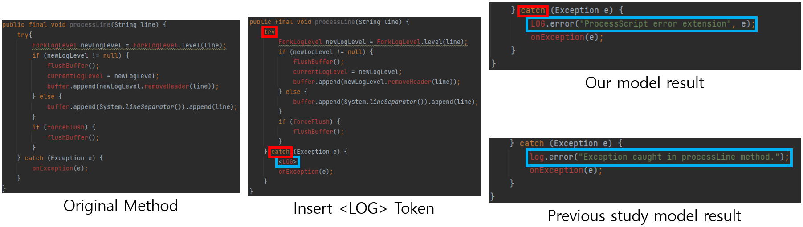
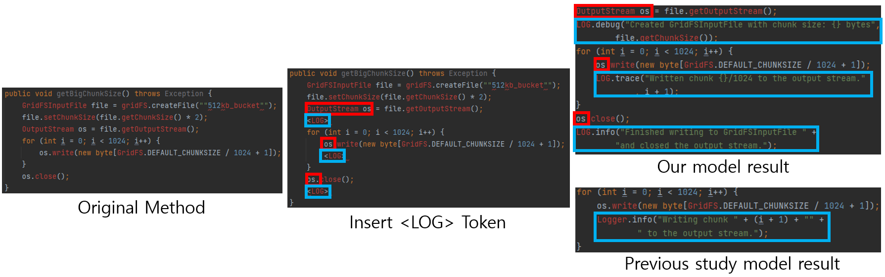
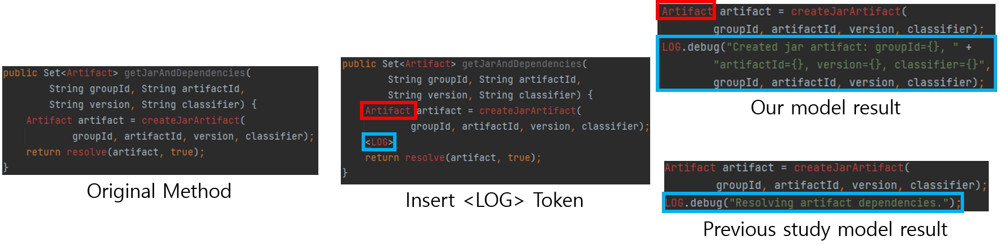
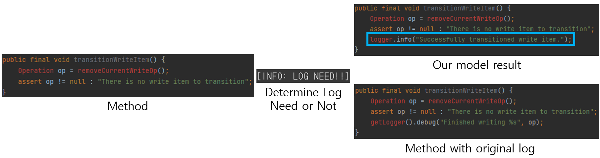

# Automated Log Generation using OS project data

### Data
We extracted a total of 24,943,104 Java methods from 2,283 GitHub repositories. Each method was examined for existing logs (SLF4J or Log4j):

- If a method included a log statement, it was classified as Fine-tuning data.
- If it did not include a log statement, it was classified as Pre-training data.

We only considered the common log levels (FATAL, ERROR, WARN, DEBUG, INFO, TRACE) and excluded any custom log levels. Methods with fewer than 10 tokens, more than 512 tokens, or non-ASCII characters were also removed. As a result:

- Pre-training Data: 22,577,797 methods, used to learn Java syntax and general code patterns.
- Fine-tuning Data: 827,253 methods, used to train the model in log message generation, log placement, and log levels.

### Proposed Approach
We built an LLM based on T5, leveraging pre-training on Java methods without logs. We then developed three distinct models:

#### First Model
Inserts logs immediately after lines containing try-catch, system calls, or external API calls.
The Fine-tuning data consists of output methods (with logs) and corresponding input methods (where each log is replaced with a <LOG> token).
Trained so that when the model sees <LOG> in the input, it replaces it with an actual log statement in the output.

#### Second Model
A classifier deciding whether a log is needed in a method.
Uses an equal mix of methods with and without logs (labeled 1 and 0, respectively).
Determines if a given method requires a log (1) or not (0).

#### Third Model
Inserts logs into any position within a method, rather than only after specific patterns.
Trained on the existing Fine-tuning data to propose log statements at all possible locations in the method.

### Result Example
#### Method include Try-Catch

#### Method include System Call

#### Method include API

### Method not include Try-Catch, System Call, API

